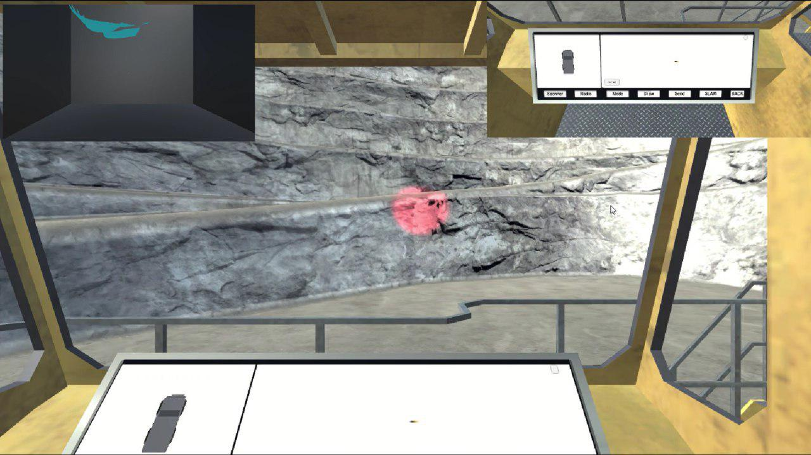
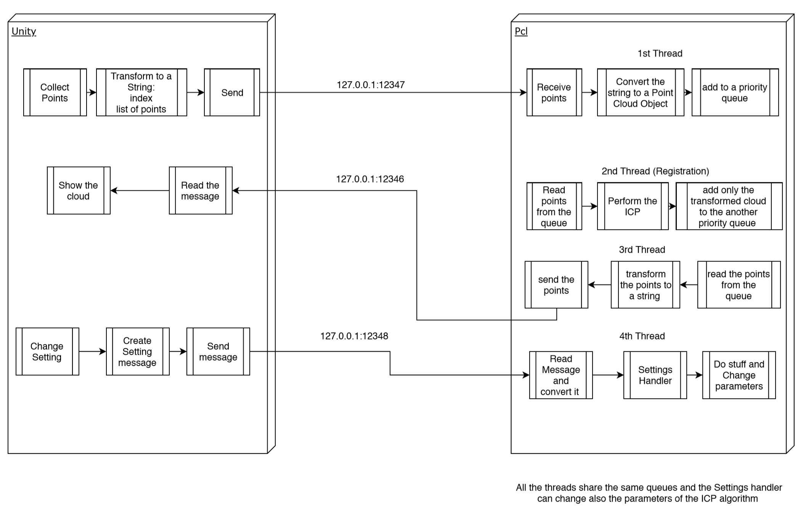
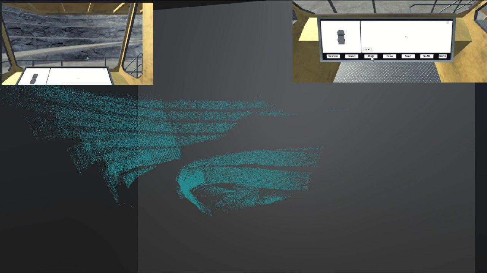

# SLAM

SLAM project for the subject of Robotic Perception and Action at University of Trento, 2019.

During this project a SLAM algorithm was developement using Unity 3D as environment.

## The task
The goal of the project was to implement a SLAM algorithm for an autonomous truck in a mine. The environment was developed using Unity 3D with a simulate ToV camera. 

    

## The project
In order to reconstruct the envinronment we used PCL (Point Cloud Library) in C++ which allow us to develop the ICP algorithm for the 3D reconstruction. However, the Unity and the PCL processes were separated and in order to let them comunicate we used ZMQ.

    

    

